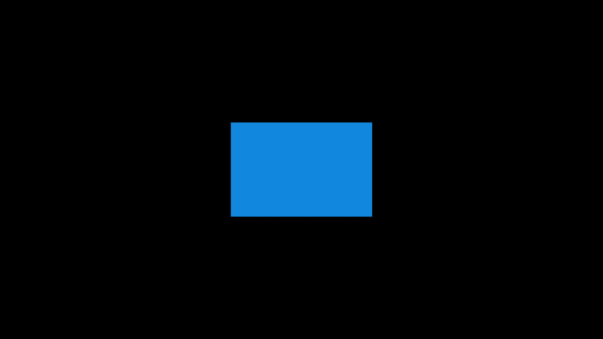

# IndieCorners

## Overview
**IndieCorners** is Free After Effects plugin that allows you to control the roundness of the corners of shapes individually, including custom shapes. Perfect for designers and animators looking for precise control over their shape aesthetics.

## Key Features
- **Create New**: Creates a standard rectangle shape where you can control each corner's roundness.
- **Replace Rect**: Replaces an existing rectangle, preserving its properties but adds the ability to control corners.
- **Replace Poly**: Replaces a custom shape made by the pen tool, imported from Figma, etc.
- **Dockable Handy UI Panel**: Features an easy-to-use panel with three buttons.
- **Adjustable Properties**: Adjust position, anchor point alignment, and size of the shape.

## Installation
1. Download the `.zxp` file 
2. Install the plugin using [ZXP Installer](https://aescripts.com/learn/zxp-installer/) or another zxp installer
3. Restart Adobe After Effects.
4. Navigate to `Window > Extensions > IndieCorners`.

## Usage
1. **Create New**:
   - Open IndieCorners panel.
   - Click on `Create New` to create a standard rectangle shape with individual corner roundness control.
   
2. **Replace Rect**:
   - Select the rectangle layer(s) you want to replace.
   - Click on `Replace Rect` to replace the existing rectangle while preserving its properties and adding corner control.
   
3. **Replace Poly**:
   - Select the custom shape layer(s) (e.g., created by the pen tool or imported from Figma).
   - Click on `Replace Poly` to replace the custom shape with one that allows individual corner roundness control.
